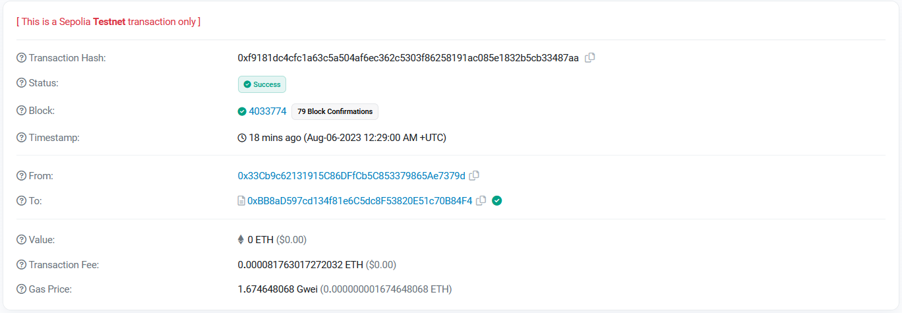
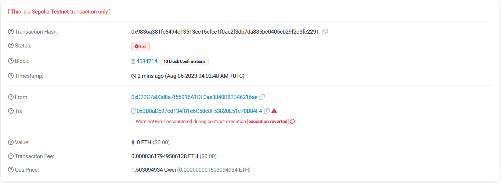
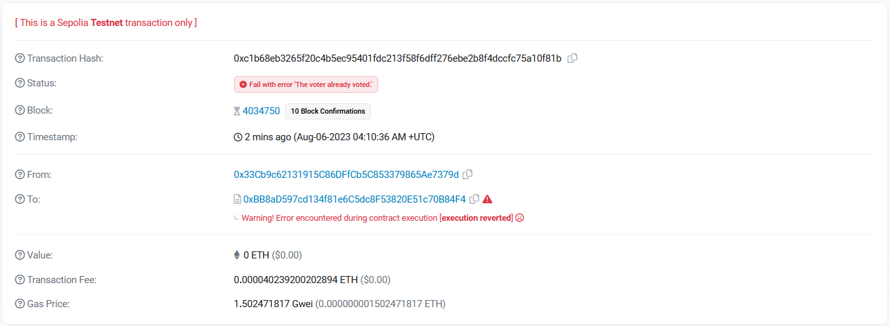
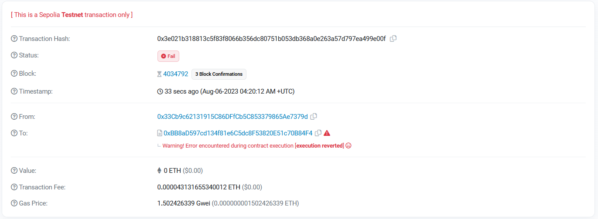
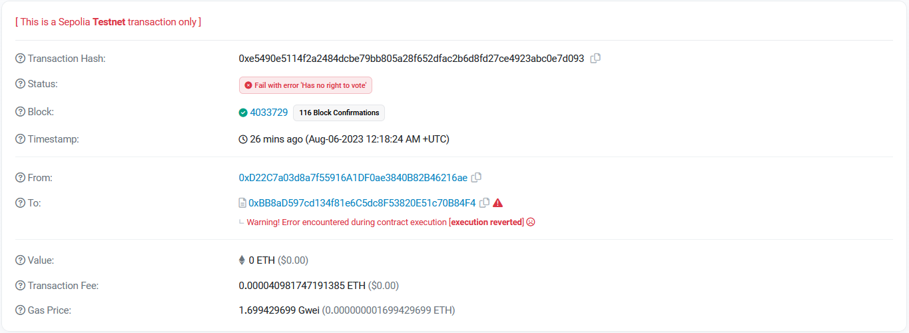
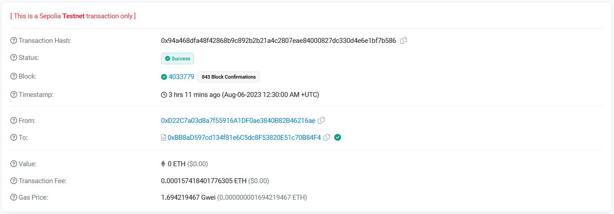
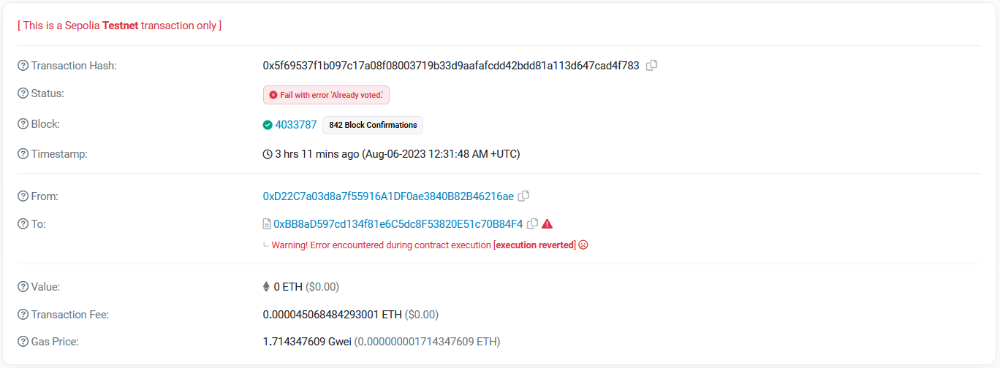

# Ballot App

Contract Address: [0x003343f128839fe6253Ab3E15265aA60E8114DeF](https://sepolia.etherscan.io/address/0x003343f128839fe6253ab3e15265aa60e8114def)

### Give right to vote

`Chairman Address`: [0x33Cb9c62131915C86DFfCb5C853379865Ae7379d](https://sepolia.etherscan.io/address/0x33Cb9c62131915C86DFfCb5C853379865Ae7379d)

`Fake Chairman Address`/`Voter 2 Address`: [0xD22C7a03d8a7f55916A1DF0ae3840B82B46216ae](https://sepolia.etherscan.io/tx/0x43a1556a19a7eccb53a006e8d6e9c9c58b5e602f550bbc48c733eb1a065abb3d)

`Voter 1 Address`: [0xd22c7a03d8a7f55916a1df0ae3840b82b46216ae](https://sepolia.etherscan.io/address/0xd22c7a03d8a7f55916a1df0ae3840b82b46216ae)

---

- Then, the **chairman** gives the **voter 1** a right to vote and **succeeded** ([0xf9181dc4cfc1a63c5a504af6ec362c5303f86258191ac085e1832b5cb33487aa](https://sepolia.etherscan.io/tx/0xf9181dc4cfc1a63c5a504af6ec362c5303f86258191ac085e1832b5cb33487aa)).
  

- An attacker (**the fake chairman**) trying to give the **voter 1** a right to vote, but **rejected** because only the chairman that has a right ([0x9836a381fc6494c13513ec15cfce1f0ac2f3db7da885bc0405cb29f2d3fc2291](https://sepolia.etherscan.io/tx/0x9836a381fc6494c13513ec15cfce1f0ac2f3db7da885bc0405cb29f2d3fc2291)).
  

- The **chairman** gives the **voter 1** a right to vote, but **rejected** because the **voter 1** already has a right to vote and voted. ([0xc1b68eb3265f20c4b5ec95401fdc213f58f6dff276ebe2b8f4dccfc75a10f81b](https://sepolia.etherscan.io/tx/0xc1b68eb3265f20c4b5ec95401fdc213f58f6dff276ebe2b8f4dccfc75a10f81b)).
  

- The **chairman** gives the **voter 2** a right to vote, but **rejected** because **the voter 2** already has a right to vote.
  ([0x3e021b318813c5f83f8066b356dc80751b053db368a0e263a57d797ea499e00f](https://sepolia.etherscan.io/tx/0x3e021b318813c5f83f8066b356dc80751b053db368a0e263a57d797ea499e00f)).
  

### Vote

`Chairman Address`: [0x33Cb9c62131915C86DFfCb5C853379865Ae7379d](https://sepolia.etherscan.io/address/0x33Cb9c62131915C86DFfCb5C853379865Ae7379d)

`Voter Address`: [0xd22c7a03d8a7f55916a1df0ae3840b82b46216ae](https://sepolia.etherscan.io/address/0xd22c7a03d8a7f55916a1df0ae3840b82b46216ae)

---

- Initially, the **voter** gives a vote to `proposal[1]`, but **rejected** since the voter doesn't have right to vote ([0xe5490e5114f2a2484dcbe79bb805a28f652dfac2b6d8fd27ce4923abc0e7d093](https://sepolia.etherscan.io/tx/0xe5490e5114f2a2484dcbe79bb805a28f652dfac2b6d8fd27ce4923abc0e7d093)).
  

- Then, the **chairman** gives the **voter** a right to vote and **succeeded** ([0xf9181dc4cfc1a63c5a504af6ec362c5303f86258191ac085e1832b5cb33487aa](https://sepolia.etherscan.io/tx/0xf9181dc4cfc1a63c5a504af6ec362c5303f86258191ac085e1832b5cb33487aa)).
  

- The **voter** gives a vote to `proposal[1]` and **succeeded** ([0x94a468dfa48f42868b9c892b2b21a4c2807eae84000827dc330d4e6e1bf7b586](https://sepolia.etherscan.io/tx/0x94a468dfa48f42868b9c892b2b21a4c2807eae84000827dc330d4e6e1bf7b586)).
  

- The **voter** gives another vote again to `proposal[1]`, but **rejected** since the voter alredy voted ([0x5f69537f1b097c17a08f08003719b33d9aafafcdd42bdd81a113d647cad4f783](https://sepolia.etherscan.io/tx/0x5f69537f1b097c17a08f08003719b33d9aafafcdd42bdd81a113d647cad4f783)).
  

## Scripts

- `giveRight [--network] [--name] [--voter] [--path]`

  - network: network alias from `hardhat.config.ts`
  - name: custom contract name for `hre.deployments.get()`. We input `Ballot2` here for our improved version. _default: Ballot_
  - voter: list of addresses. e.g. `  $ npx hardhat giveRight --network sepolia $RANDOM_ADDRESS1 $RANDOM_ADDRESS2`

  - path: file path of JSON file.

    e.g. `npx hardhat giveRight --network sepolia --name Ballot2 --path constants/address.json`

- `vote --contract <CONTRACT_ADDRESS> --signer <SIGNER> --proposal <PROPOSAL_ID>`

- `winning-proposal --contract <CONTRACT_ADDRESS>`
- demo of all scripts:
  [here](docs/SCRIPTS.md)

## Unit testing

- [report](docs/TEST.md)

## Improvements

All improvement will be implemented at [Ballot2.sol](contracts/Ballot2.sol)

1. Add events

```solidity
// Events
event GiveVoteRight(address indexed voter);
event Vote(address indexed voter, uint proposalId);
event Delegate(address indexed sender, address indexed to);
```
